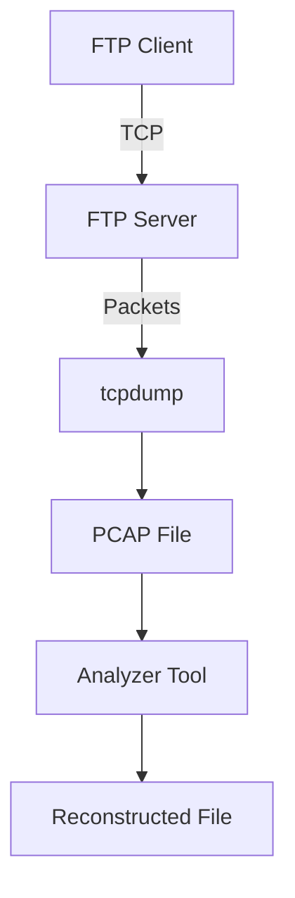
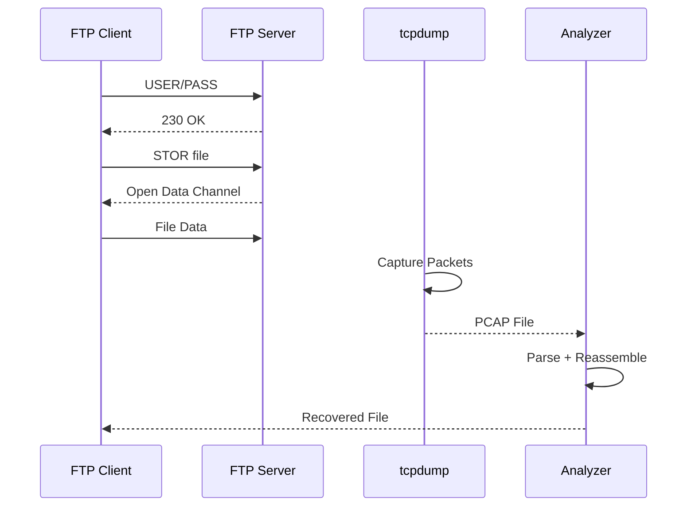
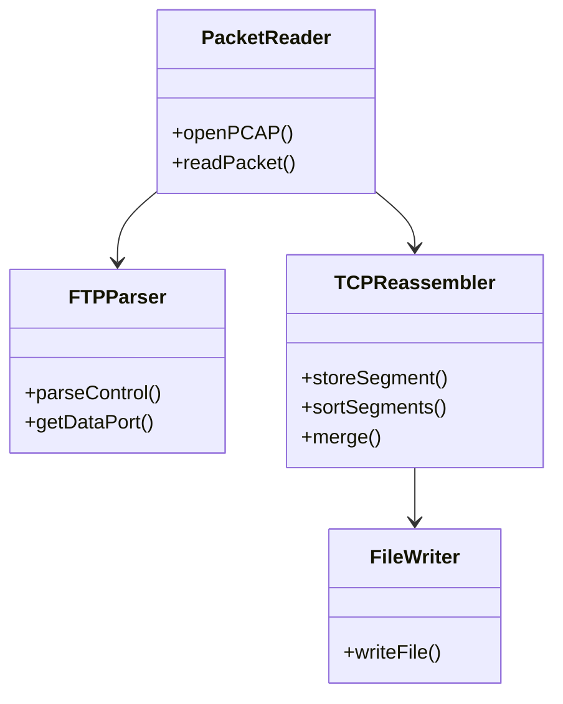

# FTP PCAP File Reconstruction Project

## 📌 Overview

This project demonstrates how to reconstruct files transferred over **FTP** by analyzing captured **PCAP** network traffic. The system captures raw TCP packets, extracts FTP data streams, reassembles them, and rebuilds the original file.

This project was developed and tested on **macOS using Homebrew and Pure-FTPd**.

---

## 🎯 Objectives

* Set up a working FTP server on macOS
* Transfer files using FTP
* Capture traffic using `tcpdump`
* Analyze PCAP using C++ and `libpcap`
* Reconstruct the original file from packets

---

## 🛠️ Tech Stack

| Component    | Tool          |
| ------------ | ------------- |
| OS           | macOS         |
| FTP Server   | Pure-FTPd     |
| Client       | ftp / lftp    |
| Capture Tool | tcpdump       |
| Analyzer     | C++ + libpcap |
| Build Tool   | g++           |

---

## 📂 Project Structure

```
project/
 ├── main.cpp           # FTP PCAP analyzer
 ├── ftp_reconstruct    # Compiled binary
 ├── ftp.pcap           # Captured packets
 ├── recovered.pdf      # Reconstructed file
 └── README.md
```

---

## ⚙️ Installation & Setup

### 1️⃣ Install Dependencies

```bash
brew install pure-ftpd libpcap
```

---

### 2️⃣ Create FTP Directory

```bash
sudo mkdir -p /tmp/ftp
sudo chown $USER /tmp/ftp
```

---

### 3️⃣ Create Virtual FTP User

```bash
sudo pure-pw useradd ftpuser \
  -u $USER \
  -d /tmp/ftp \
  -m
```

Set a password when prompted.

---

### 4️⃣ Start FTP Server

```bash
sudo pkill pure-ftpd
sudo pure-ftpd -B -l puredb:/opt/homebrew/etc/pureftpd.pdb
```

---

### 5️⃣ Verify Server

```bash
sudo lsof -i :21
```

Expected: `pure-ftpd` running.

---

## 🔐 FTP Login

```bash
ftp localhost
```

Login:

```
Username: ftpuser
Password: <your_password>
```

On success:

```
230 OK. Current directory is /
```

---

## 📡 Capturing Network Traffic

Start capture in a new terminal:

```bash
sudo tcpdump -i lo0 -w ftp.pcap tcp
```

---

## 📤 Uploading File

Inside FTP:

```bash
binary
put test.pdf
```

Expected:

```
226 Transfer complete
```

---

## 🛑 Stop Capture

Press `Ctrl + C` in tcpdump terminal.

PCAP file: `ftp.pcap`

---

## 🔍 File Reconstruction

Compile analyzer:

```bash
g++ -std=c++17 main.cpp -lpcap -o ftp_reconstruct
```

Run analyzer:

```bash
./ftp_reconstruct ftp.pcap recovered.pdf
```

---

## ✅ Verification

```bash
shasum test.pdf recovered.pdf
```

Hashes must match.

---

## ⚠️ Common Errors & Fixes

| Error                   | Cause      | Solution                |
| ----------------------- | ---------- | ----------------------- |
| 530 Login Failed        | DB missing | pure-pw mkdb            |
| Cannot write passwd.tmp | Permission | chown /opt/homebrew/etc |
| File not found          | Wrong path | !cd / use absolute path |
| Corrupt file            | ASCII mode | Use `binary`            |

---

## 🧠 Key Learnings

* FTP uses separate control and data channels
* Data channel must be isolated
* TCP reassembly is required
* Binary mode prevents corruption
* Virtual users simplify auth on macOS

---

# 📐 UML Diagrams

## 1️⃣ System Architecture Diagram



---

## 2️⃣ Sequence Diagram (File Transfer & Reconstruction)



---

## 3️⃣ Class Diagram (Analyzer)



---

## 📌 Conclusion

This project demonstrates real-world network forensics by reconstructing FTP-transferred files from packet captures. It covers protocol analysis, TCP stream reassembly, and low-level packet processing in C++.

It is directly relevant to networking, security, and systems engineering roles.

---

## 📜 Author

Developed by: Ajay Gupta
