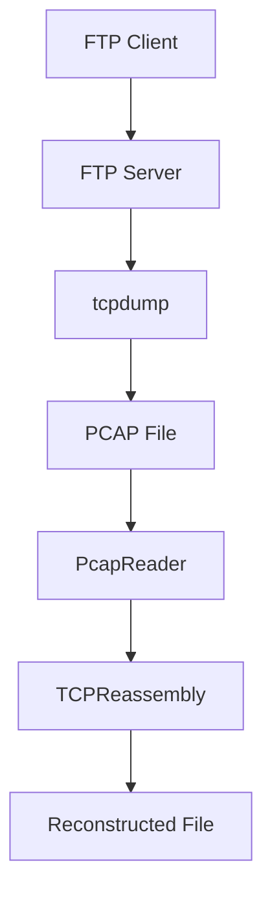
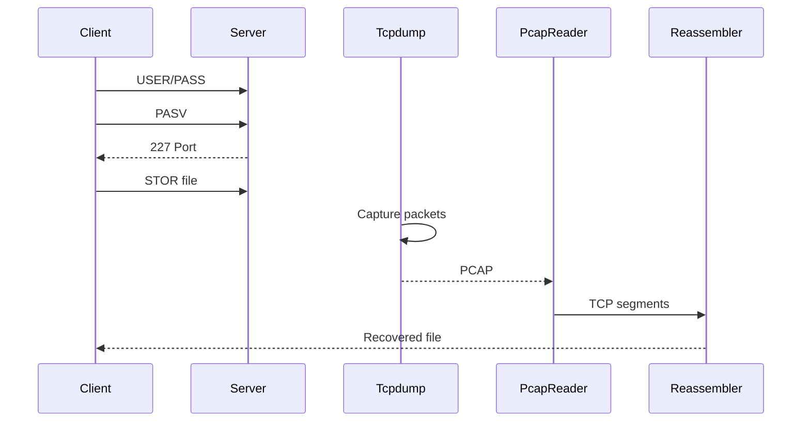
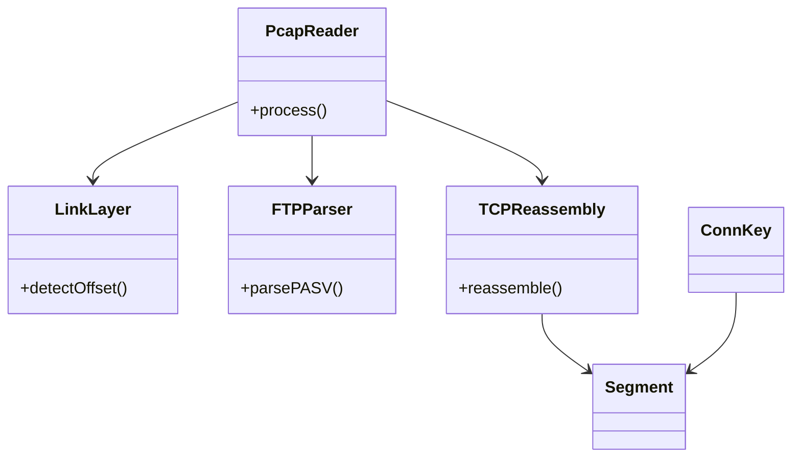

# FTP PCAP Analyzer – File Reconstruction Tool

## 📌 Overview

This project implements a C++ network analyzer that reconstructs files transferred over FTP by processing captured PCAP traffic.

It parses raw packets using `libpcap`, analyzes FTP control/data channels, performs TCP stream reassembly, and rebuilds the original file.

The project is designed with a modular architecture and was developed and tested on macOS and Linux systems.

---

## ✨ Features

- Offline PCAP processing using libpcap  
- FTP Passive (PASV) mode detection  
- Automatic data channel extraction  
- TCP sequence-based reassembly  
- Loopback and Ethernet capture support  
- CMake-based portable build system  
- Modular extensible design  

---

## 🎯 Project Goals

- Understand low-level packet processing
- Implement protocol-aware analysis
- Perform TCP stream reconstruction
- Handle OS-specific capture formats
- Build extensible network tools in C++

---

## 🛠️ Technology Stack

| Layer | Tool |
|-------|------|
| Language | C++17 |
| Packet Capture | libpcap |
| FTP Server | Pure-FTPd |
| Capture Tool | tcpdump |
| Build | CMake |
| OS Tested | macOS, Linux |

---

## 📂 Repository Structure

```
ftp-analyzer/
│
├── src/
│ ├── main.cpp
│ ├── pcap_reader.cpp
│ ├── pcap_reader.h
│ ├── link_layer.cpp
│ ├── link_layer.h
│ ├── ftp_parser.cpp
│ ├── ftp_parser.h
│ ├── tcp_reassembly.cpp
│ ├── tcp_reassembly.h
│ └── session_manager.h
│
├── build/
│
├── CMakeLists.txt
└── README.md
```

---

## ⚙️ Environment Setup

### 1️⃣ Install Dependencies

### macOS

```bash
brew install pure-ftpd libpcap cmake
xcode-select --install
```

### Linux

```bash
sudo apt install libpcap-dev cmake g++
```

## 🔧 FTP Server Configuration (macOS)

### Create FTP Root

```bash
sudo mkdir -p /tmp/ftp
sudo chown $USER /tmp/ftp
```

### Create Virtual User

```bash
sudo pure-pw useradd ftpuser \
  -u $USER \
  -d /tmp/ftp \
  -m
```

### Start Server

```bash
sudo pure-ftpd -B -l puredb:/opt/homebrew/etc/pureftpd.pdb
```

### Verify:

```bash
sudo lsof -i :21
```

---

## 📡 Packet Capture

Start capture before FTP transfer:

```bash
sudo tcpdump -i any -w ftp.pcap
```

Note: -i any is required on macOS to capture loopback traffic.

--- 

## 📤 FTP File Transfer

```bash
ftp -4 localhost
```

### Inside FTP:

```bash
binary
passive
put sample.jpg
bye
```

---

## 🛠️ Build Instructions

```bash
mkdir build
cd build
cmake ..
make
```


### Binary:

```bash
build/ftp_analyzer
```

---

## ▶️ Running the Analyzer

```bash
./ftp_analyzer ftp.pcap recovered.jpg
```

**Expected output:**

```
[+] Loopback capture
[+] PASV Data Port: 8209
[+] Reconstructed: recovered.jpg
```

## ✅ Verification

```bash
shasum sample.jpg recovered.jpg
```

Hashes must match.

---

## 🔍 Internal Processing Flow

1. Open PCAP file

2. Detect link-layer header

3. Parse IP/TCP packets

4. Extract FTP control messages

5. Detect PASV data port

6. Capture data channel packets

7. Reassemble TCP stream

8. Write output file

## ⚠️ Common Errors & Fixes

| Error                   | Cause      | Solution                |
| ----------------------- | ---------- | ----------------------- |
| 530 Login Failed        | DB missing | pure-pw mkdb            |
| Cannot write passwd.tmp | Permission | chown /opt/homebrew/etc |
| File not found          | Wrong path | !cd / use absolute path |
| Corrupt file            | ASCII mode | Use `binary`            |

---

## 🧠 Key Learnings

- FTP uses separate control and data channels

- Loopback capture differs from Ethernet

- TCP requires sequence-based reassembly

- Protocol parsing must be platform-aware

- Modular design simplifies extension

---

# 📐 UML Diagrams

## 1️⃣ System Architecture Diagram



---

## 2️⃣ Sequence Diagram (end-to-end)



---

## 3️⃣ Class Diagram (Analyzer)



---

## 🚀 Future Enhancements

IPv6 support

Active FTP (PORT/EPRT)

Multi-file sessions

Retransmission recovery

CLI filtering

Parallel stream handling

## 📌 Conclusion

This project demonstrates real-world network forensics by reconstructing FTP-transferred files from packet captures. It covers protocol analysis, TCP stream reassembly, and low-level packet processing in C++.

It is directly relevant to networking, security, and systems engineering roles.

---

## 📜 Author

Developed by: Ajay Gupta