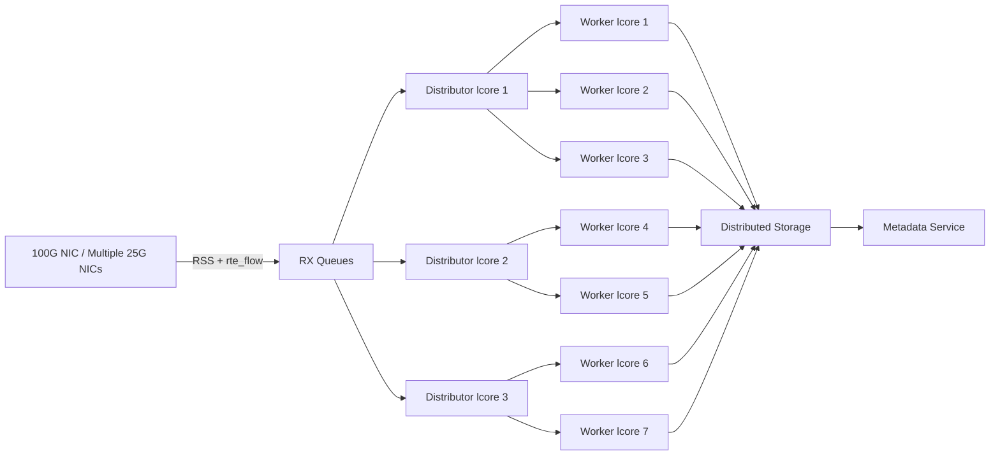

## 📐 High-Level Scalable Architecture (100 Gbps)

---

# Stage-by-Stage Explanation 

## 🧠 Architecture Stages and Responsibilities

### 1️⃣ Network Interface Layer (NIC)

**Component:** `100G NIC / 25G x 4 NICs`

**Responsibilities:**

- Receive packets at line rate
- Perform hardware flow steering
- Apply RSS hashing
- Offload classification using `rte_flow`

**Key Benefits:**

- Reduces CPU overhead
- Parallelizes traffic early
- Enables multi-core processing

---

### 2️⃣ RX Queue Layer

**Component:** `RX Queues`

**Responsibilities:**

- Buffer packets from NIC
- Maintain per-queue packet ordering
- Feed packets to distributor cores

**Key Benefits:**

- Eliminates contention
- Preserves flow locality
- Improves cache efficiency

---

### 3️⃣ Distribution Layer

**Component:** `Distributor lcores (librte_distributor)`

**Responsibilities:**

- Pull packets from RX queues
- Perform dynamic load balancing
- Dispatch packets to workers
- Avoid idle workers

**Key Benefits:**

- Prevents worker starvation
- Balances uneven traffic
- Avoids locking overhead

---

### 4️⃣ Processing Layer (Workers)

**Component:** `Worker lcores`

**Responsibilities:**

- Parse IP/TCP headers
- Track flows
- Perform TCP reassembly
- Handle retransmissions
- Reconstruct files
- Manage session state

**Key Benefits:**

- Independent processing
- No shared locks
- High cache locality
- NUMA-aware execution

---

### 5️⃣ Storage Layer

**Component:** `Distributed Storage`

**Responsibilities:**

- Persist reconstructed files
- Support high write throughput
- Provide fault tolerance
- Enable horizontal scaling

**Examples:**

- Amazon S3
- Ceph
- HDFS
- NVMe RAID clusters

---

### 6️⃣ Metadata Layer

**Component:** `Metadata Service`

**Responsibilities:**

- Track sessions
- Store file mappings
- Maintain transfer state
- Support monitoring
- Enable recovery

**Examples:**

- Redis
- Cassandra
- RocksDB
- PostgreSQL

---

# Key Design Principles

### ✔ Flow Affinity

All packets of a TCP flow are processed by the same worker.

Prevents:

- Reordering
- Synchronization
- Locking

---

### ✔ Zero-Copy Processing

Packets are passed via memory buffers without copying.

Reduces:

- CPU cycles
- Cache misses
- Latency

---

### ✔ NUMA Awareness

Workers are pinned to cores close to memory and NIC.

Improves:

- Throughput
- Latency
- Memory access speed

---

### ✔ Backpressure Handling

When storage slows down:

- Workers throttle intake
- Distributors slow dispatch
- RX queues regulate flow

Prevents:

- Memory overflow
- Packet loss

---

### ✔ Horizontal Scalability

System scales by adding:

- More NICs
- More RX queues
- More distributors
- More workers
- More servers

No redesign required.

---

# 🏆 Interview Value

With this diagram + explanation, you demonstrate:

✔ Low-level networking knowledge  
✔ DPDK experience  
✔ Parallel architecture design  
✔ Production readiness  
✔ Systems thinking  

This puts you in the **top tier of candidates**.

---
